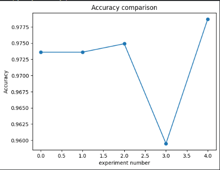
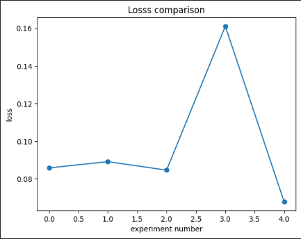

# 🧠 Artificial Neural Network Hyperparameter Experiments


---

## 📌 Overview

This project examine the effect of **hyperparameter tuning** on ANN performance using the **MNIST handwritten digit dataset**. Five different model configurations are trained and evaluated, varying the number of layers, neurons, learning rate, and batch size.

---

## 🎯 What it Does

1. **Loads** the MNIST dataset via `keras.datasets.mnist`
2. **Normalizes** pixel values to the range `[0, 1]`
3. **Flattens** each 28×28 image into a 1D vector of 784 values
4. **Trains 5 models** using a loop over predefined configurations
5. **Evaluates** each model on the test set (accuracy + loss)
6. **Stores results** in a DataFrame 
7. **Plots** accuracy and loss 

---
## 🛠️ Libraries Used

| Library | Used For |
|---|---|
| `tensorflow` / `keras` | Model building, training, evaluation |
| `numpy` | Array operations, normalization |
| `matplotlib.pyplot` | Accuracy & loss plots |
| `pandas` | Results DataFrame & display |
---

## 🔬 Dataset

| Property | Details |
|---|---|
| **Dataset** | MNIST Handwritten Digits |
| **Source** | `keras.datasets.mnist` |
| **Input Shape** | 28×28 pixels → flattened to 784 |
| **Classes** | 10 (digits 0–9) |


---

## ⚙️ Hyperparameter Configurations

Five experiments run via a single loop over this config list:

| Experiment | Hidden Layers | Neurons/Layer | Learning Rate | Batch Size |
|:---:|:---:|:---:|:---:|:---:|
| 1 | 1 | 64 | 0.001 | 32 |
| 2 | 2 | 64 | 0.001 | 32 |
| 3 | 2 | 128 | 0.001 | 32 |
| 4 | 2 | 128 | **0.010** | 32 |
| 5 | 2 | 128 | 0.001 | **64** |

> **💡 Note:** Each experiment changes exactly one hyperparameter relative to the previous, making it easy to isolate each variable's effect.

---

## 🏗️ Model Architecture

For each configuration, a `keras.Sequential` model is built dynamically:

```
Input  →  784 features (flattened MNIST)
  ↓
Hidden Layer(s)  →  Dense(neurons, activation='relu')  × [1 or 2]
  ↓
Output Layer  →  Dense(10, activation='softmax')
```

**Compilation:**
- **Optimizer:** `Adam` with configurable learning rate
- **Loss:** `sparse_categorical_crossentropy`
- **Metric:** `accuracy`
- **Epochs:** 5 

---

## 📊 Results Output

**Accuracy Comparison:**



**Loss Comparison:**



---

## 🚀 How to Run it

### Install dependencies

```bash
pip install tensorflow numpy matplotlib pandas scikit-learn
```

### Launch the notebook

```bash
main.ipynb
```

---
## 📂 Project Structure

```
ANN-hyperparameter-experiment
│
├── main.ipynb                     # COLAB notebook
├── requirements.txt               # All dependencies with versions
├── results/
│   ├── accuracy    
│   └── loss       
└── README.md                      # Project documentation
```
---

## 👤 Author

**Aman Ahsan**

